```mermaid
graph TB
    Start([Developer Task]) --> Master[MASTER_PROTOCOL]
    Master --> Decision{Task Type?}
    
    Decision -->|Bug/Error| Debug[🐛 DEEPDIVE<br/>Debug Protocol]
    Decision -->|Code Review| Review[👁️ COMPREHENSIVE<br/>Review Protocol]
    Decision -->|New Feature| Design[🎨 ULTRATHINK<br/>Frontend Protocol]
    Decision -->|Testing| Test[🧪 FULLSPEC<br/>Test Protocol]
    Decision -->|Security| Sec[🔐 SECAUDIT<br/>Security Protocol]
    Decision -->|Performance| Perf[⚡ PERFAUDIT<br/>Performance Protocol]
    
    Debug --> Result[✅ Solution]
    Review --> Result
    Design --> Result
    Test --> Result
    Sec --> Result
    Perf --> Result
    
    style Master fill:#3b82f6,color:#fff
    style Result fill:#10b981,color:#fff
    style Debug fill:#ef4444,color:#fff
    style Review fill:#8b5cf6,color:#fff
    style Design fill:#ec4899,color:#fff
    style Test fill:#f59e0b,color:#fff
    style Sec fill:#dc2626,color:#fff
    style Perf fill:#06b6d4,color:#fff
```

# AI Development Protocols



# AI Development Protocols

[](docs/CHANGELOG.md)
[](LICENSE)
[](#-protocol-files)
[](#-quick-start)
[](#-documentation)
[](BRAIN/accessibility_protocol.md)
[](BRAIN/security_audit_protocol.md)

A comprehensive collection of protocols and guidelines designed to help ANY AI assistant (Gemini, Opencode, KiloCode, Cline, RooCode, Cursor, Claude, Copilot, etc.) deliver consistent, high-quality software development assistance while reducing hallucinations and maintaining code quality.


## 🎯 Purpose

This repository provides standardized protocols that guide AI assistants through various development tasks including code review, debugging, testing, and feature development. These protocols are framework-agnostic and work with any LLM (Flash 2.0, Sonnet 3.5, GPT-4, etc.) by ensuring they respect existing codebases and follow best practices.

## 🚀 Quick Start

### ⚡ Option 1: Interactive CLI (30 seconds - Recommended)
```bash
npx @ai-protocols/init
```

**What it does:**
- Prompts for framework (Node.js, React, Next.js, Python, Manual)
- Asks which AI tools you use (Cursor, Cline, Copilot, Gemini, VSCode)
- Asks what you want to focus on (Security, Testing, Performance, Accessibility)
- Copies all protocols and configurations to your project
- Generates IDE-specific config files automatically
- Validates setup and shows next steps

**Output:** Fully configured project ready to use in 30 seconds! ✨

---

### 📦 Option 2: Manual Setup (2 minutes)

1. **Copy core files to your project:**
   ```bash
   # Copy protocols
   cp -r BRAIN/ docs/ /path/to/your/project/
   
   # Copy validation scripts
   cp -r scripts/ /path/to/your/project/
   ```

2. **Choose your IDE configuration:**
   ```bash
   # For Cursor
   cp configurations/cursor/.cursorrules /path/to/your/project/
   
   # For Cline/RooCode
   cp configurations/cline/.clinerules /path/to/your/project/
   
   # For GitHub Copilot
   mkdir -p /path/to/your/project/.github
   cp configurations/copilot/copilot-instructions.md /path/to/your/project/.github/
   
   # For VS Code
   mkdir -p /path/to/your/project/.vscode
   cp configurations/vscode/settings.json /path/to/your/project/.vscode/

   # For Opencode AI
   cp configurations/opencode/.opencoderules /path/to/your/project/
   cp configurations/opencode/opencode.json /path/to/your/project/
   ```


3. **Validate your setup:**
   ```bash
   cd /path/to/your/project
   node scripts/validate-protocols.js
   
   # Expected output:
   # ✅ BRAIN/MASTER_PROTOCOL.md
   # ✅ 18/18 BRAIN protocols present
   # ✅ Configuration detected: Cursor
   # Validation Score: 30/30 (100%)
   # Status: ✅ EXCELLENT
   ```

### 📊 Validation Score Explained

The validation script checks **30 critical items** to ensure a perfect setup:
- **3 Core Files:** (MASTER_PROTOCOL, README, IMPLEMENT_IMPROVEMENTS_PLAN)
- **18 BRAIN Protocols:** All specialized logic files in the `BRAIN/` directory.
- **4 Documentation Guides:** Essential usage instructions.
- **2 Working Examples:** Node and React project templates.
- **3 Configuration Templates:** Base configs for tools and IDEs.

**Scoring Rule:** Each item is equally weighted. A score of 30/30 (100%) confirms that the entire ecosystem is correctly integrated.

---

### 💡 Option 3: Try Working Examples First

**Node.js + Express Example** (Complete REST API):
```bash
cd examples/node-express
npm install
cp .env.example .env         # Configure JWT_SECRET and other vars
npm test                     # Run all tests (unit, integration, security)
npm run dev                  # Start development server on port 3000
```

**React + TypeScript Example** (Accessible UI):
```bash
cd examples/react-typescript
npm install
npm run dev                  # Start development on port 5173
npm test                     # Run tests with Vitest
```

**What's included:**
- ✅ Production-ready code following all protocols
- ✅ Full test suites (80%+ coverage)
- ✅ Security best practices (SECAUDIT compliant)
- ✅ Accessibility features (WCAG 2.1 AA)
- ✅ CI/CD configuration (GitHub Actions)
- ✅ Comprehensive documentation

---

### 🔍 Validation (Verify Setup Works)

After setup, always run validation:

```bash
# JavaScript (works everywhere)
node scripts/validate-protocols.js

# Bash (Linux/macOS)
bash scripts/validate-protocols.sh

# PowerShell (Windows)
powershell scripts/validate-protocols.ps1
```

**Validation checks:**
- ✅ MASTER_PROTOCOL.md exists
- ✅ All 18 BRAIN protocols present
- ✅ Documentation files found
- ✅ IDE configuration detected
- ✅ Example projects (optional)
- ✅ Configuration templates (optional)

---

### 🎯 Using the Protocols

Once setup is complete, tell your AI assistant:

```
"Use the MASTER_PROTOCOL to review my authentication code"
"Use the MASTER_PROTOCOL with DEEPDIVE to debug this error"
"Use the MASTER_PROTOCOL with FULLSPEC to add tests for this component"
```

The master protocol automatically routes to specialized protocols based on your request.

**See [docs/COMMANDS.md](docs/COMMANDS.md)** for all trigger commands and workflows.

---

### 📚 Next Steps

1. **Read Quick Start:** [docs/QUICK_START.md](docs/QUICK_START.md) (5 minutes)
2. **Try First Command:** Ask AI to review code using COMPREHENSIVE
3. **Explore Examples:** See working implementations in `examples/`
4. **Check Reference:** [docs/QUICK_REFERENCE.md](docs/QUICK_REFERENCE.md) for cheat sheet
5. **Learn Workflows:** [docs/SCENARIOS.md](docs/SCENARIOS.md) for real-world usage

**Need help?** See [docs/TROUBLESHOOTING.md](docs/TROUBLESHOOTING.md) for common issues.

## 📚 Protocol Files

### Core Protocols

| Protocol | Purpose | Trigger |
|----------|---------|---------|
| **[BRAIN/MASTER_PROTOCOL.md](BRAIN/MASTER_PROTOCOL.md)** | Main orchestrator - start here | — |
| [BRAIN/mdap_protocol.md](BRAIN/mdap_protocol.md) | Zero-error scaling for complex tasks | `MDAP` |
| [BRAIN/code_review_protocol.md](BRAIN/code_review_protocol.md) | Code review using Four Pillars framework | `COMPREHENSIVE` |
| [BRAIN/debug_protocol.md](BRAIN/debug_protocol.md) | Scientific debugging methodology | `DEEPDIVE` |
| [BRAIN/error_fix_protocol.md](BRAIN/error_fix_protocol.md) | Auto-fix errors with severity classification | `AUTODEBUG` |
| [BRAIN/test_automation_protocol.md](BRAIN/test_automation_protocol.md) | Test coverage and quality standards | `FULLSPEC` |

### Specialized Protocols

| Protocol | Purpose | Trigger |
|----------|---------|---------|
| [BRAIN/moreFRONTend-PROTOCOL.md](BRAIN/moreFRONTend-PROTOCOL.md) | Frontend architecture and UI design | `ULTRATHINK` |
| [BRAIN/FRONTandBACKend-PROTOCOL.md](BRAIN/FRONTandBACKend-PROTOCOL.md) | Full-stack development guidelines | `ANTI-GENERIC` |
| [BRAIN/bigpappa_protocol_reviewANDfixes.md](BRAIN/bigpappa_protocol_reviewANDfixes.md) | Comprehensive code audit and remediation | `BIGPAPPA` |
| [BRAIN/codebase_indexing_protocol.md](BRAIN/codebase_indexing_protocol.md) | Codebase intelligence and mapping | `FULLINDEX` |
| [BRAIN/refactor_protocol.md](BRAIN/refactor_protocol.md) | Systematic improvement with safety checks | `SAFEREFACTOR` |

### New Protocols (v1.1.0+)

| Protocol | Purpose | Trigger |
|----------|---------|---------|
| [BRAIN/security_audit_protocol.md](BRAIN/security_audit_protocol.md) | Security auditing with OWASP Top 10 | `SECAUDIT` |
| [BRAIN/accessibility_protocol.md](BRAIN/accessibility_protocol.md) | WCAG 2.1 compliance testing | `A11YCHECK` |
| [BRAIN/aria_accessibility_protocol.md](BRAIN/aria_accessibility_protocol.md) | Advanced ARIA and assistive technology | `FULLARIA` |
| [BRAIN/git_workflow_protocol.md](BRAIN/git_workflow_protocol.md) | Git conventions and CI/CD integration | `GITFLOW` |
| [BRAIN/api_design_protocol.md](BRAIN/api_design_protocol.md) | REST/GraphQL API design patterns | `APIDESIGN` |
| [BRAIN/performance_protocol.md](BRAIN/performance_protocol.md) | Core Web Vitals and optimization | `PERFAUDIT` |
| [BRAIN/OPTIMIZED_LINT_SETUP.md](BRAIN/OPTIMIZED_LINT_SETUP.md) | Linting setup for modern stacks | — |

## 🛡️ Core Principles

- **Zero Hallucination** - Read actual code, verify library versions, follow existing patterns
- **Codebase Respect** - No unauthorized UI/design/architecture changes
- **Evidence-Based** - No speculation without logs, traces, or reproduction steps
- **Surgical Precision** - Identify exact problematic code, avoid aggressive refactoring
- **Fix + Prevent** - Address immediate issue AND prevent recurrence

## 🎓 Key Features

### Special Modes
- **DEEPDIVE** - Full system scan with multi-layer investigation
- **ULTRATHINK** - Exhaustive reasoning with multi-dimensional analysis

### Code Quality Standards
Apply the **Four Pillars** to all reviews:
1. Correctness
2. Readability
3. Performance
4. Maintainability

### Safety Classification
- 🟢 **SAFE** - Auto-fix always (formatting, unused imports)
- 🟡 **LOW-RISK** - Auto-fix with confirmation (type annotations)
- 🟠 **MODERATE** - Show diff first (logic changes)
- 🔴 **HIGH-RISK** - Never auto-fix (auth, payments, migrations)

## 📊 Protocol Relationship Diagram

```
┌─────────────────────────────────────────────────────────────────┐
│                     USER REQUEST                                 │
│          "Use the MASTER_PROTOCOL to [task]"                    │
└────────────────────────┬────────────────────────────────────────┘
                         │
                         ▼
┌─────────────────────────────────────────────────────────────────┐
│                   MASTER_PROTOCOL.md                             │
│  ┌──────────────────────────────────────────────────────────┐  │
│  │  1. Analyze Intent                                       │  │
│  │  2. Scan Codebase (Respect existing patterns)          │  │
│  │  3. Route to Appropriate Protocol(s)                   │  │
│  │  4. Execute with Safety Checks                         │  │
│  └──────────────────────────────────────────────────────────┘  │
└────────┬───────┬────────┬────────┬────────┬────────┬───────────┘
         │       │        │        │        │        │
    ┌────▼───┐ ┌▼─────┐ ┌▼─────┐ ┌▼─────┐ ┌▼─────┐ ┌▼──────────┐
    │ Code   │ │Debug │ │Error │ │Test  │ │Front │ │ Codebase  │
    │Review  │ │      │ │Fix   │ │Auto  │ │end   │ │ Indexing  │
    └────┬───┘ └┬─────┘ └┬─────┘ └┬─────┘ └┬─────┘ └┬──────────┘
         │      │        │        │        │        │
         └──────┴────────┴────────┴────────┴────────┘
                         │
                    ┌────▼─────┐
                    │ Backend  │
                    └────┬─────┘
                         │
            ┌────────────┴────────────┐
            │                         │
    ┌───────▼────────┐      ┌────────▼────────┐
    │  BigPappa      │      │   Lint Setup    │
    │  (Full Audit)  │      │   (Config)      │
    └────────────────┘      └─────────────────┘
```

### Protocol Flow Examples

**Example 1: Bug Fix Request**
```
User → MASTER_PROTOCOL → BRAIN/debug_protocol.md
                       → BRAIN/error_fix_protocol.md
                       → BRAIN/test_automation_protocol.md
                       → BRAIN/code_review_protocol.md (verify fix)
```

**Example 2: Feature Development**
```
User → MASTER_PROTOCOL → BRAIN/codebase_indexing_protocol.md (understand patterns)
                       → BRAIN/moreFRONTend-PROTOCOL.md (build UI)
                       → BRAIN/FRONTandBACKend-PROTOCOL.md (add API)
                       → BRAIN/test_automation_protocol.md (add tests)
```

**Example 3: Code Review**
```
User → MASTER_PROTOCOL → BRAIN/code_review_protocol.md (Four Pillars)
                       → BRAIN/codebase_indexing_protocol.md (check dependencies)
                       → BRAIN/test_automation_protocol.md (verify coverage)
```

## 📖 Documentation

- **docs/UNIVERSAL_INTEGRATION.md** - Detailed instructions for ANY AI assistant (Gemini, Cline, RooCode, etc.)
- **MASTER_PROTOCOL.md** - Complete routing logic and execution templates
- **Individual Protocol Files** - Specialized deep-dive guides for each task type in the `BRAIN/` folder

## 🎯 Success Metrics

When using these protocols, you should see:

- ✅ **Reduced Hallucinations** - AI follows actual codebase patterns
- ✅ **Consistent Quality** - Every code change meets the Four Pillars standards
- ✅ **Faster Debugging** - Scientific method eliminates guesswork
- ✅ **Better Tests** - Coverage targets met with meaningful tests
- ✅ **Preserved Architecture** - No unauthorized design changes
- ✅ **Clear Communication** - Evidence-based, constructive feedback

## 🔧 Customization Guide

Make these protocols work for your team:

1. **Add Project-Specific Rules**
   ```markdown
   ## Our Team's Conventions
   - We use Zustand for state management
   - All components must be in PascalCase
   - API routes follow REST conventions
   ```

2. **Adjust Coverage Targets**
   ```markdown
   - Business-Critical: 100%
   - Core Features: 90% (increased from 80%)
   - Utilities: 75%
   ```

3. **Define Custom Safety Rules**
   ```markdown
   🔴 HIGH-RISK (Never auto-fix):
   - Payment processing
   - User authentication
   - Data migrations
   - [Your critical paths]
   ```

## 🤝 Contributing

These protocols are designed to be adapted and customized. Contributions welcome:

- **Report Issues** - Found a gap in the protocols? Open an issue
- **Suggest Improvements** - Better ways to structure protocols
- **Share Examples** - Real-world success stories
- **Create Extensions** - New specialized protocols for emerging patterns

## 🌟 Use Cases

Perfect for:
- **Solo Developers** - Using AI pair programming tools (Cursor, Copilot)
- **Development Teams** - Standardizing AI-assisted code reviews
- **Code Audits** - Comprehensive quality assessments
- **Onboarding** - Teaching AI assistants your codebase patterns
- **Refactoring Projects** - Systematic improvement with safety checks

## 📄 License

MIT License - Use freely in personal and commercial projects

## 🙏 Acknowledgments

Built on principles from:
- Software engineering best practices
- The Scientific Method for debugging
- Accessibility standards (WCAG)
- Zero-blame culture methodologies

---

**Version:** 1.0.0  
**Last Updated:** 2025-12-21  
**Status:** Active Development  
**Maintained by:** Community Contributors

---

### Quick Links

- [📖 Universal Integration Guide (docs/UNIVERSAL_INTEGRATION.md)](docs/UNIVERSAL_INTEGRATION.md)
- [⚡ Protocol Commands & Workflow (docs/COMMANDS.md)](docs/COMMANDS.md)
- [🎯 Start with Master Protocol](MASTER_PROTOCOL.md)
- [🔍 Browse All Protocols](BRAIN/)
- [💬 Report Issues](../../issues)
- [⭐ Star This Repository](../../stargazers)
