# 🤖 Protocol Trigger Commands

This guide provides a comprehensive catalog of all trigger commands available in the AI Development Protocols system, organized into a highly efficient workflow.

---

## 📊 Perfect Workflow Diagram

```mermaid
graph TD
    Start((🚀 START)) --> P1[Phase 1: Intelligence]
    P1 -->|FULLINDEX| P1a[📊 Mapping]
    P1 -->|BIGPAPPA| P1b[🔍 System Audit]
    
    P1b --> P2[Phase 2: Planning]
    P2 -->|APIDESIGN| P2a[🔌 API Design]
    P2 -->|ULTRATHINK| P2b[🧠 Deep Architecture]
    
    P2b --> P3[Phase 3: Development]
    P3 -->|ANTI-GENERIC| P3a[🎨 Premium UI]
    P3 -->|HYBRID| P3b[⚡ Design + Tech]
    P3 -->|QUICK| P3c[⚡ Fast Task]
    
    P3b --> P4[Phase 4: Optimization]
    P4 -->|PERFAUDIT| P4a[🚀 Performance]
    P4 -->|SAFEREFACTOR| P4b[✨ Code Quality]
    
    P4b --> P5[Phase 5: Quality & CI/CD]
    P5 -->|FULLSPEC| P5a[🧪 Testing]
    P5 -->|COMPREHENSIVE| P5b[👁️ Code Review]
    P5 -->|A11YCHECK| P5c[♿ Accessibility]
    P5 -->|SECAUDIT| P5d[🔐 Security]
    P5 -->|GITFLOW| P5e[🌿 Branch Mgmt]
    
    P5e --> P6[Phase 6: Maintenance]
    P6 -->|DEEPDIVE| P6a[🐛 Debug Incident]
    P6 -->|AUTODEBUG| P6b[🔧 Auto-Fix]
    P6a --> Finish((✅ END))
    P6b --> Finish
    
    style Start fill:#3b82f6,color:#fff
    style Finish fill:#10b981,color:#fff
    style P1 fill:#8b5cf6,color:#fff
    style P2 fill:#ec4899,color:#fff
    style P3 fill:#f59e0b,color:#fff
    style P4 fill:#06b6d4,color:#fff
    style P5 fill:#10b981,color:#fff
    style P6 fill:#ef4444,color:#fff
```



---

## 🛠️ Command Catalog

### Phase 1: Intelligence & Audit
*Groundwork tools for understanding the system.*

| Command | Protocol | Description |
|:---|:---|:---|
| **`FULLINDEX`** | [codebase_indexing](../BRAIN/codebase_indexing_protocol.md) | **Codebase Intelligence:** Creates a comprehensive map of all files, functions, and components. |
| **`BIGPAPPA`** | [bigpappa_audit](../BRAIN/bigpappa_protocol_reviewANDfixes.md) | **System Health Audit:** Performs a deep scan for logic flaws, security risks, and architectural technical debt. |

### Phase 2: Design & Planning
*Defining the architecture and unique design language.*

| Command | Protocol | Description |
|:---|:---|:---|
| **`ULTRATHINK`** | [moreFRONTend](../BRAIN/moreFRONTend-PROTOCOL.md) | **Deep Reasoning:** Suspends brevity for exhaustive multi-dimensional analysis (UX, A11y, Performance). |
| **`APIDESIGN`** | [api_design](../BRAIN/api_design_protocol.md) | **Contract Definition:** Designs REST or GraphQL APIs with consistent errors, pagination, and type safety. |

### Phase 3: Development & Aesthetics
*Execution for both visual and technical excellence.*

| Command | Protocol | Description |
|:---|:---|:---|
| **`ANTI-GENERIC`** | [FRONTandBACKend](../BRAIN/FRONTandBACKend-PROTOCOL.md) | **Visual Uniqueness:** Rejects templates for bespoke, premium UI designs with intentional asymmetry. |
| **`HYBRID`** | [FRONTandBACKend](../BRAIN/FRONTandBACKend-PROTOCOL.md) | **Full-Stack Fusion:** Balances high-end design aesthetics with rigorous technical performance. |
| **`QUICK`** | [FRONTandBACKend](../BRAIN/FRONTandBACKend-PROTOCOL.md) | **Rapid Execution:** Prioritizes speed and precision for straightforward technical tasks. |

### Phase 4: Refinement & Optimization
*Polishing code and increasing efficiency.*

| Command | Protocol | Description |
|:---|:---|:---|
| **`PERFAUDIT`** | [performance](../BRAIN/performance_protocol.md) | **Performance Optimization:** Focuses on Core Web Vitals, bundle size reduction, and DB query profiling. |
| **`SAFEREFACTOR`** | [refactor](../BRAIN/refactor_protocol.md) | **Risk-Mitigated Refactoring:** Systematic code improvement without changing external behavior. |

### Phase 5: Quality Assurance & CI/CD
*Verifying stability, security, and accessibility.*

| Command | Protocol | Description |
|:---|:---|:---|
| **`FULLSPEC`** | [test_automation](../BRAIN/test_automation_protocol.md) | **Complete Coverage:** Generates a full suite of unit, integration, and E2E tests for the implementation. |
| **`COMPREHENSIVE`** | [code_review](../BRAIN/code_review_protocol.md) | **Expert Review:** Peer-level audit across Four Pillars (Correctness, Readability, Performance, Maintainability). |
| **`A11YCHECK`** | [accessibility](../BRAIN/accessibility_protocol.md) | **WCAG Verification:** Comprehensive accessibility audit for WCAG 2.1 AA/AAA compliance. |
| **`SECAUDIT`** | [security_audit](../BRAIN/security_audit_protocol.md) | **Vulnerability Scan:** OWASP Top 10 auditing, secret detection, and dependency risk assessment. |
| **`GITFLOW`** | [git_workflow](../BRAIN/git_workflow_protocol.md) | **Workflow Standards:** Ensures PRs meet team conventions, commit linting, and CI/CD ready branches. |

### Phase 6: Incidents & Support
*Emergency response and automated remediation.*

| Command | Protocol | Description |
|:---|:---|:---|
| **`DEEPDIVE`** | [debug](../BRAIN/debug_protocol.md) | **Emergency Debugging:** Scientific methodology to isolate root causes in production environments. |
| **`AUTODEBUG`** | [error_fix](../BRAIN/error_fix_protocol.md) | **Automated Remediation:** Safe execution for linting, simple types, and formatting error fixes. |

---

## 🎯 Pro-Tip: Multi-Command Stacking

You can stack these commands in your prompt for maximum efficiency:
*Example:* *"Use the MASTER_PROTOCOL to implement the login screen using **ULTRATHINK** and **ANTI-GENERIC**, then add **FULLSPEC** tests."*

---

## 🚀 New Tools & Resources

### Interactive Setup CLI
Quick project setup with automated configuration:
```bash
# Interactive setup (recommended)
npx @ai-protocols/init

# Prompts for:
# - Framework (Node.js, React, Next.js, Python, etc.)
# - AI Tools (Cursor, Cline, Copilot, Gemini, VSCode)
# - Focus Areas (Security, Testing, Performance, Accessibility)

# Output: Fully configured project in 30 seconds
```

### Validation Scripts
Verify your setup is correct:
```bash
# JavaScript (cross-platform, recommended)
node scripts/validate-protocols.js

# Bash (Linux/macOS)
bash scripts/validate-protocols.sh

# PowerShell (Windows)
powershell scripts/validate-protocols.ps1

# Expected output:
# ✅ MASTER_PROTOCOL.md
# ✅ 15/15 BRAIN protocols present
# ✅ Configuration detected: Cursor
# Validation Score: 28/28 (100%)
# Status: ✅ EXCELLENT
```

### Working Examples
Production-ready project templates:

**Node.js + Express Example** (`examples/node-express/`)
- Complete REST API with JWT authentication
- Rate limiting and security middleware (Helmet, CORS)
- Comprehensive test suites (unit, integration, security)
- CI/CD configuration (GitHub Actions)
- Follows SECAUDIT, APIDESIGN, FULLSPEC protocols

```bash
cd examples/node-express
npm install
cp .env.example .env
npm test           # Run tests
npm run dev        # Start development server
npm run lint       # Check code quality
```

**React + TypeScript Example** (`examples/react-typescript/`)
- Full application with routing and error boundaries
- Accessible components (WCAG 2.1 AA compliant)
- Custom hooks (useAuth, useDebounce)
- Vitest testing framework
- Follows ULTRATHINK, A11YCHECK, PERFAUDIT protocols

```bash
cd examples/react-typescript
npm install
npm run dev        # Start development
npm test           # Run tests
npm run lint       # Check code quality
```

### Configuration Templates
Ready-to-use configurations in `configurations/`:
- `eslint.config.js` - ESLint flat config with TypeScript support
- `prettier.config.js` - Code formatting standards
- `tsconfig.base.json` - Base TypeScript configuration
- `.clinerules` - Cline/RooCode AI assistant rules
- `system-instructions.txt` - Gemini configuration
- `kilocode-config.json` - KiloCode setup
- `vscode/settings.json` - VS Code workspace settings

### Documentation Suite
Comprehensive guides for all scenarios:
- **[QUICK_START.md](QUICK_START.md)** - 5-minute setup guide
- **[SCENARIOS.md](SCENARIOS.md)** - 6 real-world usage examples
- **[TROUBLESHOOTING.md](TROUBLESHOOTING.md)** - Common issues and solutions
- **[FAQ.md](FAQ.md)** - 40+ frequently asked questions
- **[CASE_STUDIES.md](CASE_STUDIES.md)** - Success stories with metrics

---

## 📚 Quick Navigation

| Document | Purpose | When to Use |
|----------|---------|-------------|
| [COMMANDS.md](COMMANDS.md) | All trigger commands | Daily reference |
| [QUICK_REFERENCE.md](QUICK_REFERENCE.md) | One-page cheat sheet | Quick lookup |
| [QUICK_START.md](QUICK_START.md) | Setup instructions | First time setup |
| [SCENARIOS.md](SCENARIOS.md) | Real-world examples | Learning workflows |
| [TROUBLESHOOTING.md](TROUBLESHOOTING.md) | Problem solving | When stuck |
| [FAQ.md](FAQ.md) | Common questions | Understanding concepts |
| [CASE_STUDIES.md](CASE_STUDIES.md) | Success stories | Proving ROI |

---

## 🎓 Learning Path

### Beginner (Day 1)
1. Run `npx @ai-protocols/init` to setup
2. Try first command: `Use MASTER_PROTOCOL with COMPREHENSIVE to review this code`
3. Read [QUICK_REFERENCE.md](QUICK_REFERENCE.md) for common triggers

### Intermediate (Week 1)
1. Explore working examples in `examples/`
2. Read [SCENARIOS.md](SCENARIOS.md) for workflow patterns
3. Practice chaining protocols: `ULTRATHINK → FULLSPEC → COMPREHENSIVE`

### Advanced (Week 2+)
1. Customize protocols for your tech stack
2. Add team-specific rules
3. Create custom protocol workflows
4. Measure and share ROI metrics

---

**[Back to MASTER_PROTOCOL](../BRAIN/MASTER_PROTOCOL.md)** | **[Back to README](../README.md)**
